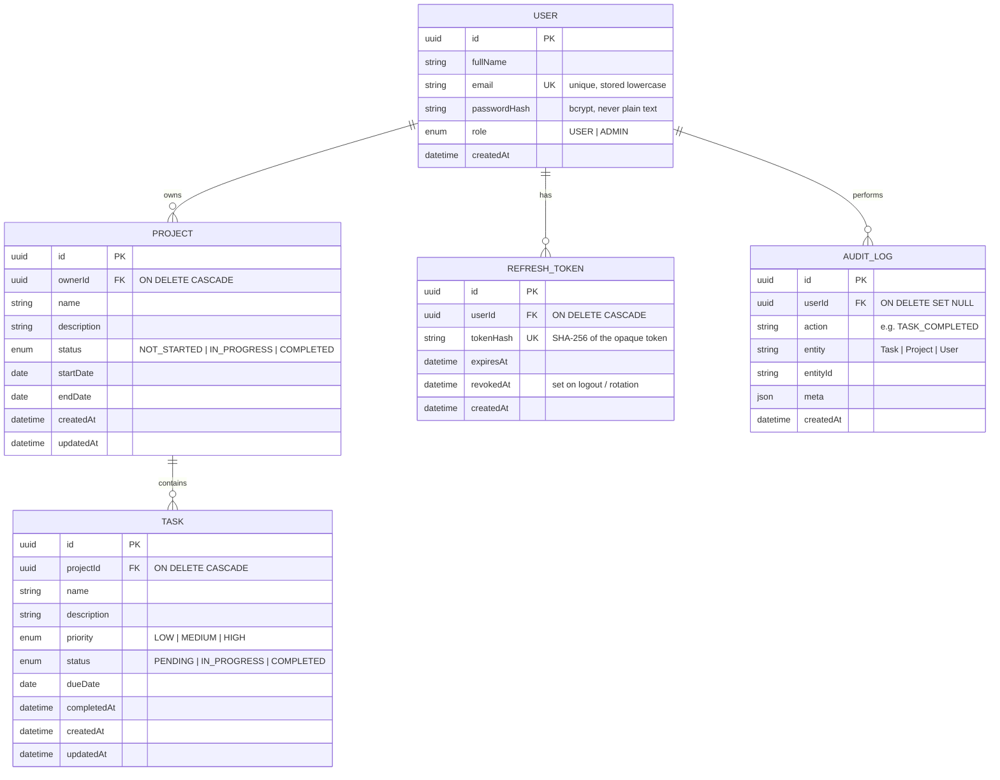

# Database schema (PostgreSQL)

Source of truth: [`backend/prisma/schema.prisma`](../backend/prisma/schema.prisma). Mermaid renders automatically on GitHub.

## Design notes

- **Normalised (3NF):** a task belongs to exactly one project, a project to exactly one owner. Tasks carry **no** `userId`; ownership is derived through `project.ownerId`, so there is a single place where access is decided.
- **Foreign keys with cascades:** deleting a user removes their projects, tasks and refresh tokens; deleting a project removes its tasks. Audit rows are kept (`SET NULL`) so history survives account deletion.
- **Indexes:** `(ownerId, status)`, `(ownerId, name)` for project lists/filters; `(projectId, status)` and `dueDate` for task lists and the dashboard; `(userId, createdAt)` for activity feeds.
- **Enum order:** `TaskPriority` is declared LOW, MEDIUM, HIGH so `ORDER BY priority` sorts correctly.
- **Refresh tokens** are stored only as SHA-256 hashes, so a database leak does not leak usable sessions.
